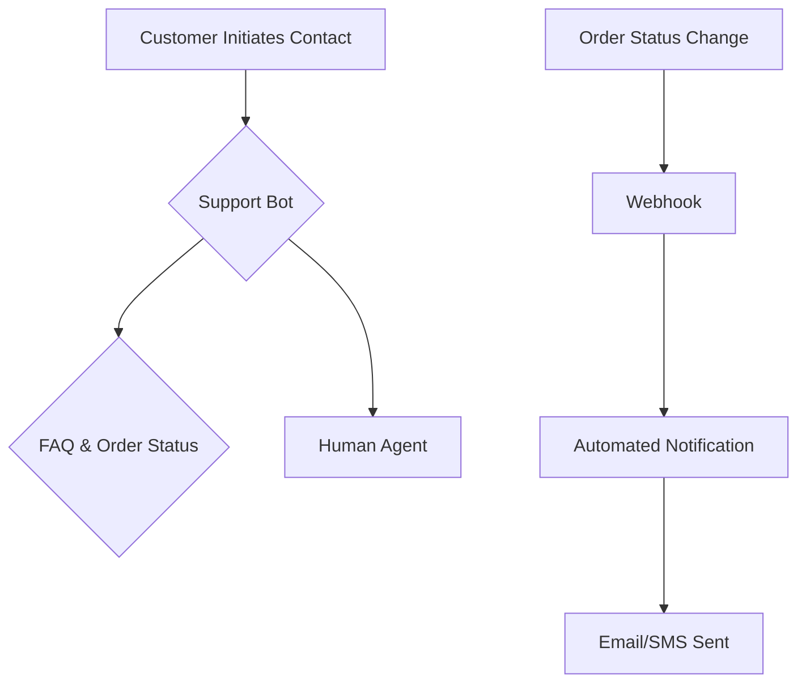

# AI Automations (Future Phase)

**Status**: Post-launch implementation (estimated 25,000 HKD additional budget)

This section outlines AI-powered automations planned for implementation after the core e-commerce platform is live and order/payment flows are polished.

## Proposed Automation Features

| Feature | Purpose | Implementation Timeline |
| --- | --- | --- |
| **Customer Support Bot** | Handle FAQs, order lookups, agent routing | Phase 5 (post-launch) |
| **Proactive Order Updates** | Automated email/SMS notifications | Phase 5 (post-launch) |
| **Inventory Alerts** | Low stock notifications for admin | Phase 5 (post-launch) |

## Customer Support Bot
- **Functionality**: Chatbot for common queries, order status, FAQ responses
- **Integration**: Links with MedusaJS order system and knowledge base
- **Goal**: Reduce response times, free up human agents

## Proactive Order Updates  
- **Functionality**: Automated notifications triggered by order status changes
- **Channels**: Email and SMS delivery options
- **Goal**: Improve customer communication, reduce inquiries

## Process Flow

