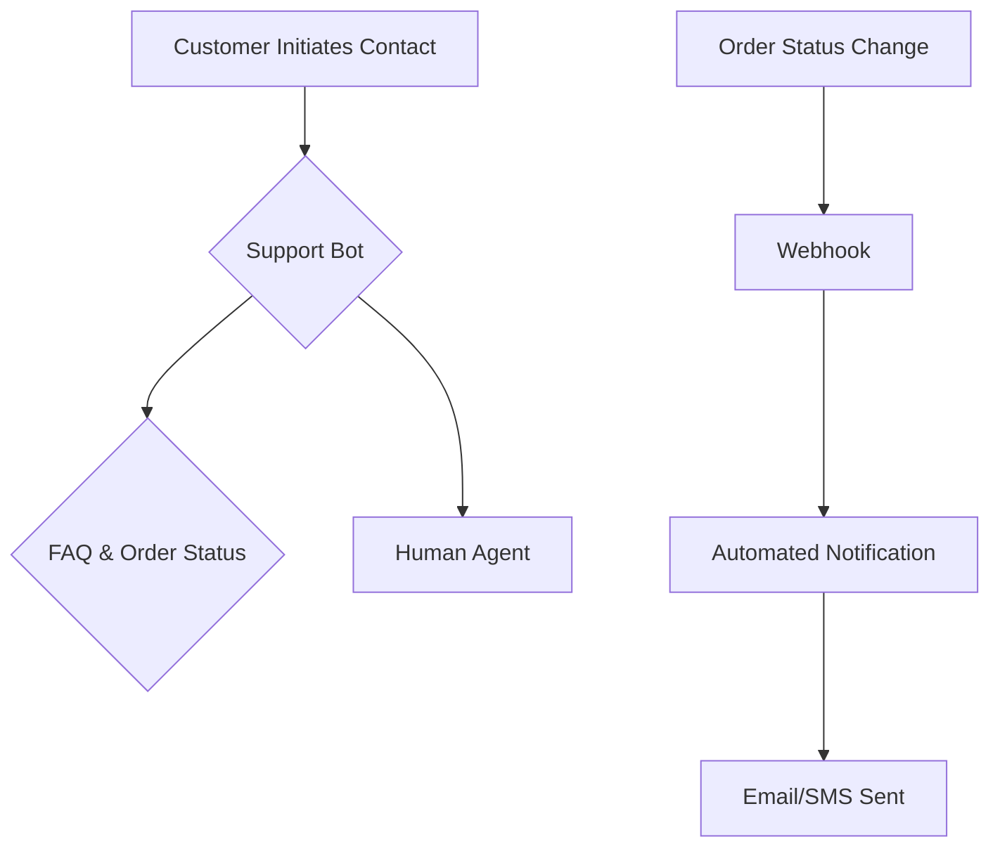

# AI Automations

This section outlines AI-powered automations to enhance customer experience and operational efficiency.

## Customer Support Bot

- **Functionality**: A chatbot to handle common customer queries, including order status lookups, FAQs, and routing complex issues to a human agent.
- **Goal**: Reduce response times and free up human agents for high-value interactions.

## Proactive Order Updates

- **Functionality**: Automated notifications (via email or SMS) triggered by order status changes (e.g., shipped, out for delivery, delivered).
- **Goal**: Improve customer communication and reduce "Where is my order?" inquiries.

## Process Flow

