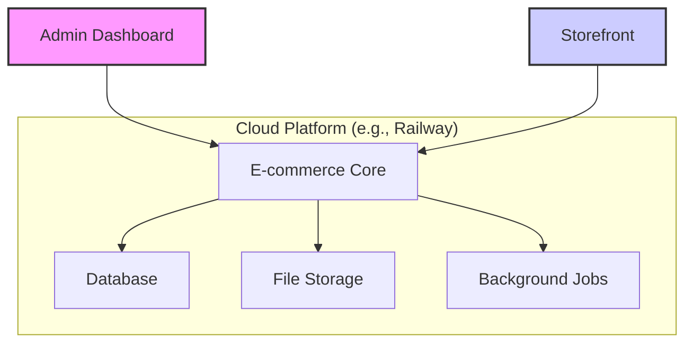

# Backend Architecture

This section describes the proposed backend system, built for scalability and reliability.

## Proposed Stack

- **Platform**: A modern e-commerce platform (e.g., MedusaJS 2.x) hosted on a scalable cloud provider like Railway.
- **Core Modules**: The system will include modules for robust inventory management, file storage (e.g., MinIO for images/certificates), and email notifications.

## Product Data Model

- **Product Types**: The catalog will be structured to support both "White Lab Diamonds" and "Fancy Color Lab Diamonds".
- **Key Attributes**: Essential diamond characteristics (shape, carat, color, clarity, cut, lab type, certificate) will be stored as primary product data.
- **Inventory Logic**: Each unique diamond stone will be managed as a single inventory item to prevent overselling, even if it's presented with different settings or metals.

## High-Level System Design

