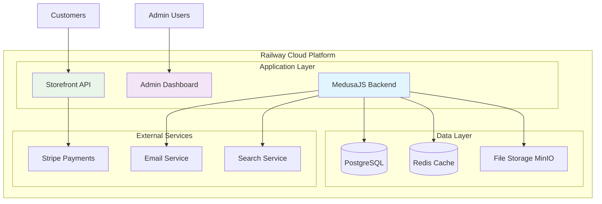
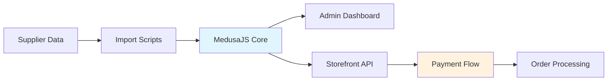

# Backend Architecture

This section describes the backend system development across Phase 1 (infrastructure) and Phase 2 (application development), built for scalability and reliability.

## Phase 1: Infrastructure Setup (Weeks 1-2)

| Component | Technology | Purpose |
| --- | --- | --- |
| **Application Platform** | MedusaJS 2.x | E-commerce core with bundled products |
| **Hosting** | Railway | Scalable cloud deployment |
| **Database** | PostgreSQL | Primary data storage |
| **File Storage** | MinIO/S3 | Images, certificates, documents |
| **Search** | Meilisearch (MVP), Redis (cache) | Faceted search and caching |
| **Email** | Transactional service | Order confirmations, notifications |

## Infrastructure Schema

## Phase 1: Data Schema Discovery (Weeks 1-2)

| Component | Details |
| --- | --- |
| **Business Model Analysis** | Diamond characteristics, pricing models, supplier data formats |
| **Product Types** | White Lab Diamonds, Fancy Color Lab Diamonds structure |
| **Key Attributes** | Shape, carat, color, clarity, cut, lab type, certificate fields |
| **Inventory Logic** | Single inventory item per unique stone (prevent overselling) |

## Phase 2: Parallel Development (Weeks 2-5)

### Development Approach
- **Week 2-3**: Start backend/frontend modules as soon as architecture is clear
- **Week 3-4**: Complete bundling logic, Stripe integration, API endpoints
- **Week 5**: Final testing and optimization
- **Continuous**: SEO technical implementation from the beginning

### Product Settings & Bundles
- **Bundled Products**: Use Medusa's bundled product feature for stone + setting combinations
- **Product Settings Menu**: Admin dashboard for bundle configuration (rings, necklaces, etc.)
- **Per-Product Variations**: Setting-specific options (ring sizes, metal types, chain lengths)
- **Payment Integration**: Stripe integration for secure payment processing

### Inventory Reservation Workflow

- **Unique Stones**: Each diamond is a single-quantity inventory item tied to its certificate
- **Temporary Reservation**: When added to cart, the item is held (reserved) for a short window to prevent double-selling
- **Checkout Confirmation**: On successful payment, the reservation converts to a final deduction; on timeout or abandonment, stock is released automatically
- **Admin Visibility**: Reservations and expirations appear in admin for monitoring and manual override if needed

### Development Deliverables
| Week | Deliverable |
| --- | --- |
| 2-3 | Core MedusaJS setup, data models, admin interface |
| 3-4 | Bundling logic, Stripe integration, API endpoints, Meilisearch indexing |
| 5 | Final testing, optimization, bug fixes |

## System Integration Flow

