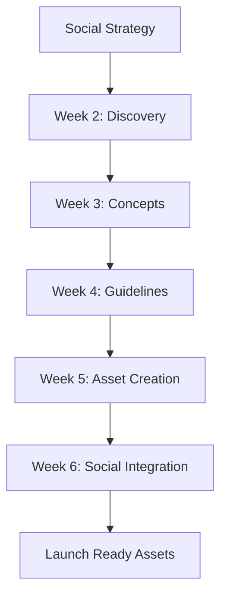

# Branding

This section outlines the branding approach developed in parallel with social media strategy (Weeks 2-6), focusing on practical brand guidelines for launch while maintaining strategic alignment.

## Parallel Development Timeline

| Timeline | Branding Milestone | Integration with Social |
| --- | --- | --- |
| **Weeks 2-3** | Discovery & concept development | Social strategy alignment discussion |
| **Weeks 4-5** | Brand guidelines creation | Moodboard development for content |
| **Week 6** | Guidelines finalization | Asset kit preparation for social launch |

## Launch Branding Deliverables

| Component | Description | Purpose |
| --- | --- | --- |
| **Visual Identity** | Colors, fonts, basic logo elements | Consistent brand recognition |
| **Design Tokens** | Colors, typography, spacing tokens for UI | Faster implementation across frontend |
| **Website Branding** | About us pages, company story, contact form | Customer trust and engagement |
| **Asset Kit** | Templates, icons, social media formats | Social content creation |

## Development Process

## Optional Next Phase: Advanced Branding & Creative Direction

- **Investment**: 90,000 HKD
- **Scope**: Comprehensive branding and visual strategy, including:
  - **Brand Positioning**: Market analysis, competitor differentiation, unique value proposition
  - **Creative Strategy**: Extended art direction, visual language development
  - **Brand Architecture**: Complete brand system, messaging framework
  - **Creative Assets**: Professional photography, video production, advanced design elements

