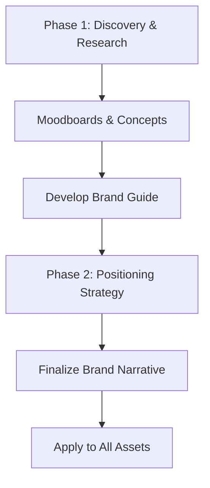

# Branding

This section outlines the proposed branding deliverables to establish a strong market presence. For launch we recommend a minimal, practical identity, with deeper strategic work scheduled once real customer feedback is available.

## Phase 1: Foundational Branding

- **Deliverables**: A comprehensive brand guide including color system, typography rules, and logo usage guidelines.
- **Goal**: Ensure a consistent and professional visual identity across all digital touchpoints.

## Phase 2: Strategic Branding

- **Deliverables**: In-depth market positioning, competitor analysis, and moodboards that define the brand's unique narrative.
- **Goal**: Differentiate the brand from competitors and connect with the target audience on an emotional level.

## Branding Development Flow

## Optional Next Phase: Creative Direction

- **Investment**: 30,000 HKD
- **Scope**: Comprehensive branding and visual strategy, including differentiation from competitors and extended art direction.

