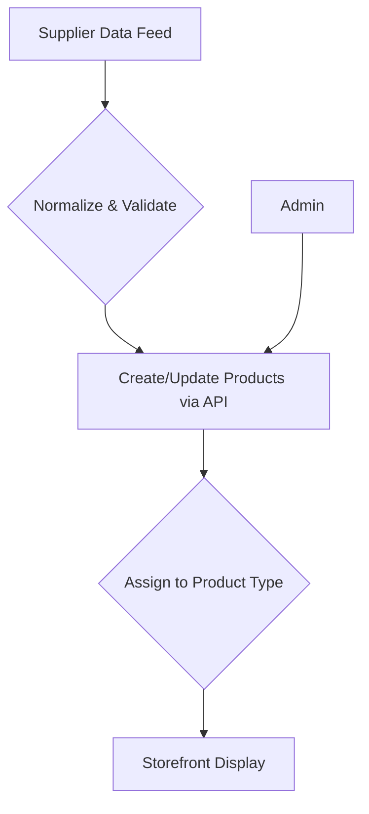

# Catalog & SKU Strategy

This section outlines the proposed strategy for managing a large and detailed diamond catalog.

## Product Assortment

- **White Lab Diamonds**: A curated selection of high-quality diamonds in the D–K color range.
- **Fancy Color Lab Diamonds**: A collection of premium diamonds in sought-after fancy colors.

## Inventory & Variant Strategy

- **Unique Stone Management**: Each diamond is treated as a unique, single-quantity item tied to its certificate, ensuring no double-selling.
- **Bundled Settings**: Rather than pre-generating variants for every stone, settings are configured as Medusa.js **bundled products**. Staff can attach a diamond to a ring, pendant or other setting at order time.
- **Contextual Variations**: Each setting exposes only its relevant options (rings allow size and metal type; necklaces may offer chain length or style), keeping the stone inventory untouched.

## Inventory Reservation Policy

- **One-of-one Stones**: Inventory quantity is 1 per stone
- **Reservation Window**: Add-to-cart creates a temporary reservation to avoid double-selling
- **State Transitions**: available → reserved → sold (or released on timeout)
- **Auditability**: Reservation logs retained for reconciliation and customer support

## Data Import & Management

- **Process**: A streamlined process will be developed to import, normalize, and validate data from supplier feeds (CSV/JSON).
- **Quality Control**: Automated validators will ensure all incoming products meet required data standards (e.g., shape, carat, certificate).

## SKU Naming Convention

- **Proposal**: A clean, human-readable SKU system will be implemented to simplify inventory management and reporting.
  - **Example Stone SKU**: `1.93-OV-I-VS2` (Carat-Shape-Color-Clarity)
  - **Example Bundle SKU**: `1.93-OV-I-VS2|RING-YG-14K` (Stone | Setting + Metal)

## Catalog Workflow

