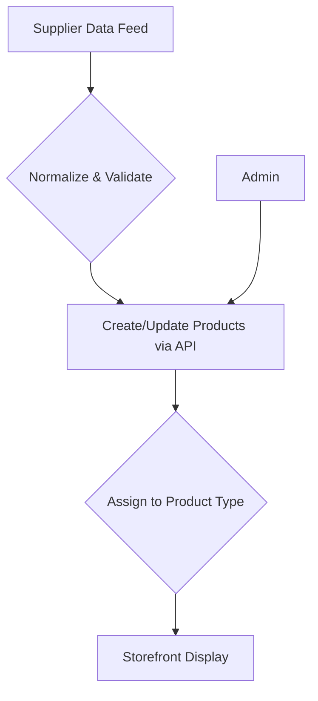

# Catalog & SKU Strategy

This section outlines the proposed strategy for managing a large and detailed diamond catalog.

## Product Assortment

- **White Lab Diamonds**: A curated selection of high-quality diamonds in the D–K color range.
- **Fancy Color Lab Diamonds**: A collection of premium diamonds in sought-after fancy colors.

## Inventory & Variant Strategy

- **Unique Stone Management**: Each diamond is treated as a unique, single-quantity item tied to its certificate, ensuring no double-selling.
- **Setting & Metal Options**: Customers can visualize a single stone with various settings (e.g., ring, pendant) and metals, which will be managed as product variants without affecting the stone's core inventory.

## Data Import & Management

- **Process**: A streamlined process will be developed to import, normalize, and validate data from supplier feeds (CSV/JSON).
- **Quality Control**: Automated validators will ensure all incoming products meet required data standards (e.g., shape, carat, certificate).

## SKU Naming Convention

- **Proposal**: A clean, human-readable SKU system will be implemented to simplify inventory management and reporting.
  - **Example Stone SKU**: `1.93-OV-I-VS2` (Carat-Shape-Color-Clarity)
  - **Example Variant SKU**: `1.93-OV-I-VS2-YG-14K-SOL` (Stone + Setting Details)

## Catalog Workflow

