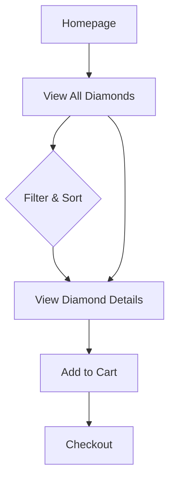

# E‑commerce (Storefront)

This section details the proposed features and user experience for the customer-facing website.

## Core User Experience

- **Technology**: A modern, fast, and mobile-friendly storefront built with technologies like Next.js.
- **Data Strategy**: Product information will be fetched efficiently from the backend, with filtering and sorting handled instantly in the user's browser for a seamless experience.

## Diamond Search & Discovery

- **Type Switcher**: A clear distinction between "White" and "Fancy Color" diamonds, each with tailored filters.
- **Advanced Filtering**:
  - **Universal Filters**: Shape, cut grade, carat, price, and lab certification.
  - **White Diamond Filters**: Specific color grades (D–K) and clarity grades (FL–SI2).
  - **Fancy Diamond Filters**: A curated selection of fancy colors.
- **Educational Tooltips**: Helpful information will be available to guide users on topics like clarity and cut.

## Diamond Results Display

- **Custom Tables**: Two distinct table layouts will be designed to showcase the key attributes of white vs. fancy colored diamonds.
- **Sortable Headers**: Users can easily sort the diamond listings by any attribute, such as price or carat weight.

## User Journey

