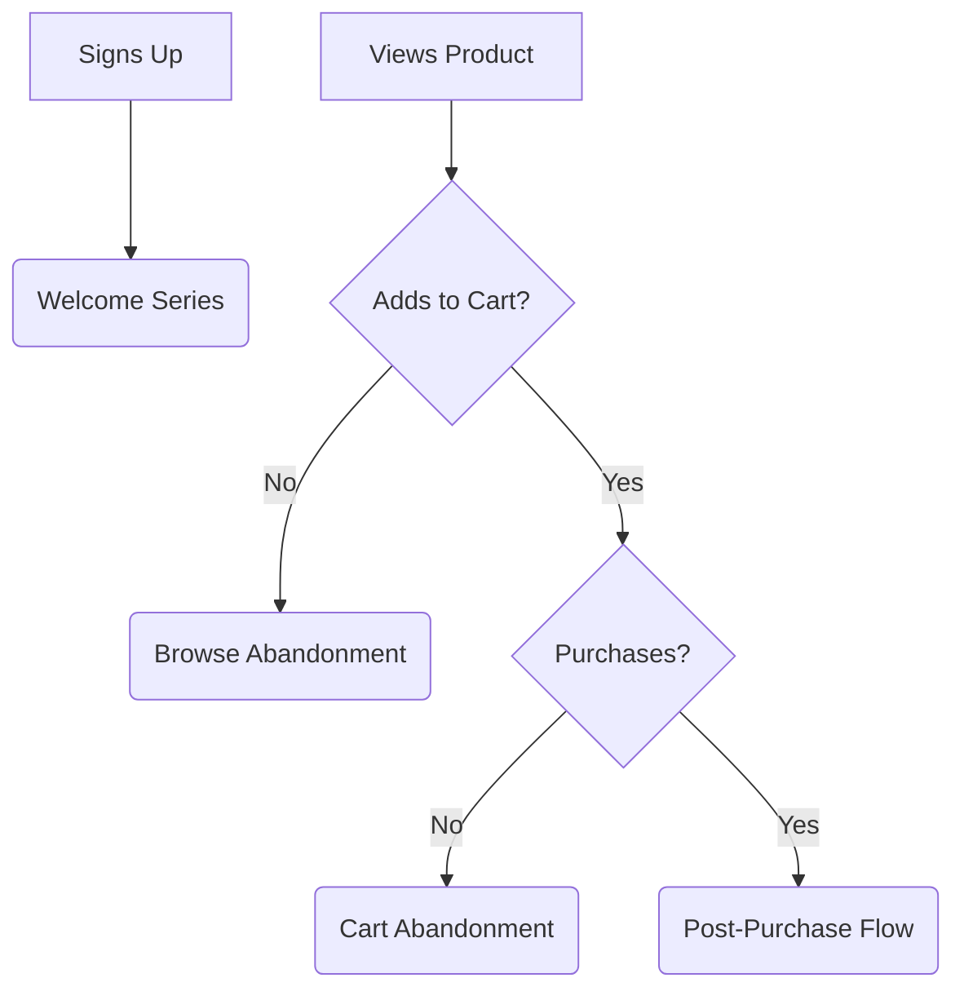

# Email Marketing

This section outlines the proposed email marketing strategy to nurture leads and drive sales.

## Automated Email Flows

- **Welcome Series**: A sequence of emails to introduce new subscribers to the brand.
- **Browse Abandonment**: A reminder email sent to users who viewed products but did not add to cart.
- **Cart Abandonment**: A sequence to recover potentially lost sales from users who added items to their cart but did not purchase.
- **Post-Purchase**: A flow that includes order confirmation, shipping updates, and a request for review.

## Email Campaigns

- **Templates**: Professionally designed templates for both transactional (e.g., order confirmations) and promotional (e.g., new arrivals, sales) emails.

## Customer Journey & Email

