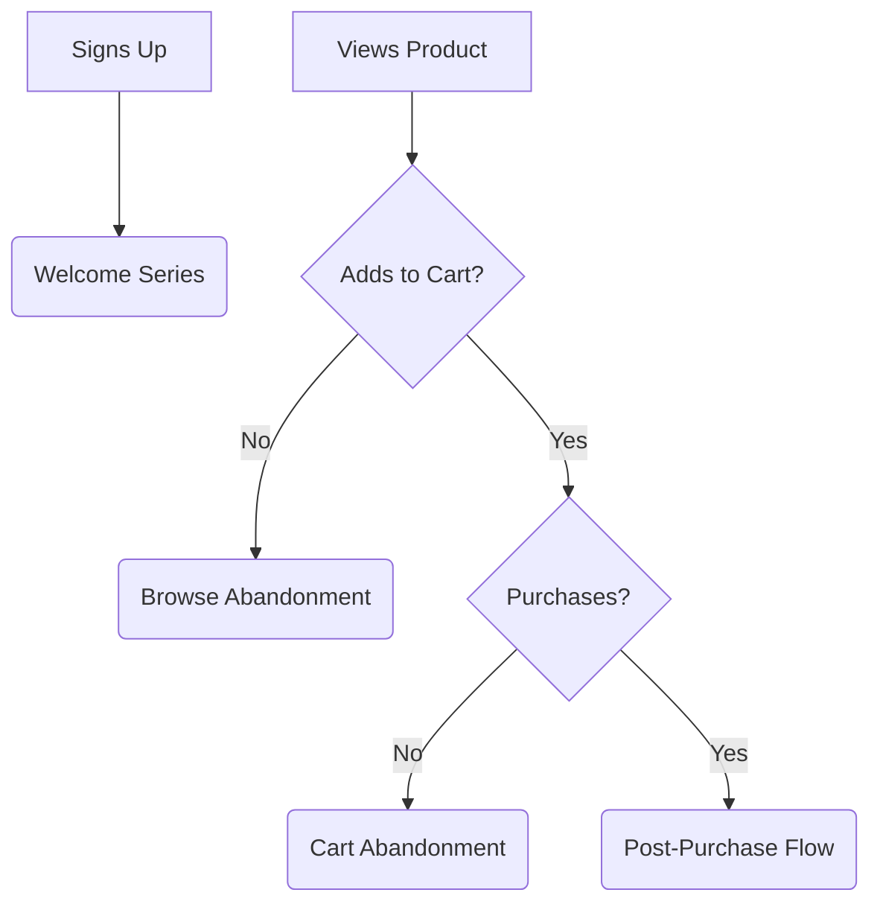

# Email Marketing (Future Phase)

**Status**: Post-launch implementation (estimated 15,000 HKD additional budget)

This section outlines the email marketing strategy to be implemented after the order and payment flows are polished and proven stable.

## Planned Email Automation Strategy

| Flow Type | Purpose | Implementation Priority |
| --- | --- | --- |
| **Welcome Series** | New subscriber onboarding | Phase 5 (post-launch) |
| **Browse Abandonment** | Re-engage product viewers | Phase 5 (post-launch) |
| **Cart Abandonment** | Recover abandoned purchases | Phase 5 (post-launch) |
| **Post-Purchase** | Order updates, review requests | Phase 5 (post-launch) |

## Email Infrastructure Requirements

| Component | Description | Dependencies |
| --- | --- | --- |
| **Transactional Emails** | Order confirmations, shipping updates | Stable order/payment flow |
| **Marketing Platform** | Automation, segmentation, analytics | Customer data integration |
| **Template System** | Branded email designs | Finalized brand guidelines |

**Prerequisites**: Completed order processing, payment flow stability, customer data collection systems

## Customer Journey & Email

