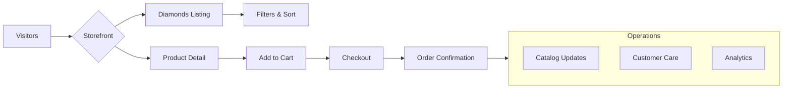

# Proposal

**Total investment (one‑off build)**: 235,000 HKD

The kickoff budget covers design, development and launch. After go‑live, a recurring maintenance retainer ensures the site and supporting services stay healthy.

This proposal outlines a plan to launch a premium lab‑grown diamond storefront and supporting operations, focusing on outcomes, scope and timelines. The solution leverages **Medusa.js bundled products** with a dedicated **Product Settings** menu to configure rings, necklaces and other styles.

## Proof of Concept

Following research and prototyping, we have built a working prototype that demonstrates the core storefront and admin workflow. This proof of concept shows our capability, commitment and the strong potential of the project, offering reassurance that we can deliver the full solution.

### Prototype Access

| Area | URL | Credentials |
| --- | --- | --- |
| Backend (Admin) | https://backend-store.dev.vodka/app | admin@yourmail.com / bnmugz7hs4gsk65l0566eos2s4kxmeho |
| Storefront | https://store.dev.vodka/ | Public |

### Prototype Scope & Findings

| Area | Status | Notes |
| --- | --- | --- |
| Backend customization basics | Completed | Validated admin extensions and custom fields wiring |
| Stone metadata model | Completed | Tested metadata for two stone categories: White and Fancy; flexible attributes for search and filters |
| Setting bundles (stone + setting) | Not included in prototype | Planned validation next; to confirm UX and inventory constraints before implementation |

### Performance & Tech Highlights

- Built on modern tooling (MedusaJS backend, Railway infra, Meilisearch for fast faceting, optimized Next.js storefront)
- Focus on doing the fundamentals right: clean data model, efficient search, image optimization, and caching
- The result is a very fast browsing experience with snappy filtering and sub‑second navigations when deployed correctly

## Deliverables (initial launch scope)

| Phase | Deliverable | Description |
| --- | --- | --- |
| **Phase 1** | [Backend architecture](./backend) | MedusaJS + infrastructure + data schema |
| **Phase 1** | [Catalog strategy](./catalog) | Product types, bundling logic, import tooling |
| **Phase 2** | [Ecommerce website](./ecommerce) | Storefront with payment integration (Stripe) |
| **Phase 2** | [Branding](./branding) | Visual Identity (colors, fonts) + about us pages |
| **Phase 2-3** | [Social media setup](./social) | Accounts, calendar, content framework |
| **Phase 3** | [Operations & training](./operations) | Admin guides, import processes, troubleshooting |
| **Phase 3** | [SEO foundation](./seo) | Technical setup + content strategy |

### Future Phases (post-launch)
- **Analytics & Tracking**: Performance monitoring, conversion tracking, customer insights
- [AI automations](./automations) (support bot, order updates)
- [Email marketing](./email) (after order/payment flow is polished)
- **Contact Form & Support**: Customer inquiry management system
- **Localization**: Multi-language storefront and content localization
- Paid advertising campaigns (separate proposal)

### Accounts, Domains & Admin

| Area | Scope |
| --- | --- |
| **Email & Domains** | Domain configuration, DNS, email provider setup |
| **Google Business Admin** | Tenant setup and management (per-account fees TBD) |
| **Project Workspace** | Lark workspace for PM, docs, assets |

## Timeline (6-7 weeks)

| Phase | Duration | Key Activities |
| --- | --- | --- |
| **Phase 1: Discovery & Infrastructure** | Weeks 1‑2 | Business model discovery, data schema, infrastructure deployment |
| **Phase 2: Parallel Development** | Weeks 2‑5 | Backend/frontend modules, bundling logic, Stripe integration |
| **Phase 3: Operations & Launch Prep** | Weeks 5‑6 | Admin training, SEO implementation, social media setup |
| **Phase 4: Soft Launch** | Week 7 | Testing, polish, soft launch, handover |

### Parallel Workstreams

| Timing | Branding & Social | SEO Preparation |
| --- | --- | --- |
| Weeks 2‑3 | Initial branding discussions, social media strategy | SEO strategy planning, keyword research |
| Week 4 | Brand guidelines development, social setup | Technical SEO implementation, content planning |
| Week 5 | Social media accounts, calendar, automations | SEO foundation completion |

## Budget Breakdown (HKD)

| Category | Amount | Phase |
| --- | --- | --- |
| Engineering (backend + frontend + Stripe) | 105,000 | 1-3 |
| Catalog ops + import tooling | 30,000 | 1 |
| SEO foundation + content strategy | 30,000 | 1-3 |
| Visual Identity (colors, fonts) | 10,000 | 2 |
| Social media setup (incl. accounts, calendar, automations, basic AI content, image optimization) | 30,000 | 2-3 |
| Training & documentation | 15,000 | 3 |
| Contingency | 15,000 | - |
| **Total initial launch budget** | **235,000** | |

> Note: Google Business Admin per-account fees are billed separately (TBD by number of users).

## Payment Schedule

| Payment Stage | Percentage | Amount (HKD) | Trigger |
| --- | --- | --- | --- |
| **Contract Signing** | 30% | 70,500 | Project commitment & start work |
| **Basic Site Architecture** | 30% | 70,500 | Backend + working frontend completed |
| **Final Delivery** | 40% | 94,000 | Everything completed, before launch |

### Optional Future Phases
| Phase | Amount | Description |
| --- | --- | --- |
| Advanced Branding & Creative Direction | 90,000 | Comprehensive visual strategy, brand positioning, competitor analysis |
| AI automations | 25,000 | Support bot, order updates |
| Email marketing flows | 15,000 | After order flow polish |
| Analytics & tracking setup | TBD | Performance monitoring, conversion tracking |
| Paid advertising setup | TBD | Separate proposal |

## Ongoing Monthly Retainer (HKD)

- Agency maintenance (catalog updates, uptime, accessibility): 8,000
- Hosting & infrastructure (Railway, object storage, search): ~1,000
- Social media management & content (incl. one day photo/video): 10,000
- Optional: Performance marketing management (paid social/search): on request

## Phase Scope & Exclusions

### Initial Launch Scope
- Diamond-first user flow (select stone, then setting)
- Basic payment processing with Stripe
- Core admin functionality and training
- SEO foundation and social media framework
- No paid advertising campaigns (separate proposal required)

### Post-Launch Phases
- **Email Marketing**: Comprehensive flows after order/payment polish
- **AI Automations**: Support bots and automated notifications  
- **Advanced UX**: Setting-first flow (choose ring, then compatible diamonds)
- **Paid Campaigns**: Social and search advertising (separate engagement)
- **Video Production**: Enhanced creative content

## MVP Acceptance Checklist

| Area | Criteria |
| --- | --- |
| Storefront | Diamonds listing, PDP, cart, Stripe test checkout works |
| Admin | Create/edit products, manage orders and fulfillments |
| Catalog | Imports v1 runs, validation reports generated |
| Inventory | Reservation on add-to-cart, release on timeout, final deduction on payment |
| Search | Meilisearch indexes diamonds and facets work |
| SEO | URL structure, meta, sitemap/robots implemented |
| Content | Basic About page and contact form live |
| Performance | Images optimized, core pages < 3s on 4G |
| QA | Launch checklist passed and signed off |

## Vision Diagram

Use the sidebar to see scope per area.

