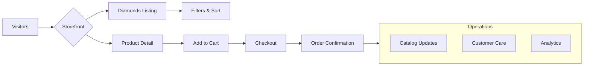

# Proposal

**Total investment (one‑off build)**: 250,000 HKD

The kickoff budget covers design, development and launch. After go‑live, a recurring maintenance retainer ensures the site and supporting services stay healthy.

This proposal outlines a plan to launch a premium lab‑grown diamond storefront and supporting operations, focusing on outcomes, scope and timelines. The solution leverages **Medusa.js bundled products** with a dedicated **Product Settings** menu to configure rings, necklaces and other styles.

## Proof of Concept

Following research and prototyping, we have built a working prototype that demonstrates the core storefront, bundling logic and admin workflows. This proof of concept shows our capability, commitment and the strong potential of the project, offering reassurance that we can deliver the full solution.

## Deliverables (high‑level)

- [Ecommerce website](./ecommerce)
- [Backend architecture](./backend) (MedusaJS + inventory + imports)
- [Catalog and bundling strategy](./catalog) (white + fancy product types, thousands of SKUs)
- [Operations & management](./operations) (imports, ops, training docs)
- [SEO and content](./seo) (site structure, blog, AI‑assisted long‑form)
- [Branding](./branding) (basic consultancy to start)
- [Social media](./social) (content creation + management)
- [AI automations](./automations) (support bot, order updates)
- [Email marketing](./email) (foundational flows; campaigns later)

## Timeline (12 weeks)

| Phase | Duration |
| --- | --- |
| Discovery & IA | Weeks 1‑2 |
| Backend & Storefront Build | Weeks 3‑5 |
| UX & Admin Training | Weeks 6‑7 |
| SEO & Content Pipeline | Weeks 8‑9 |
| Automations & QA | Weeks 10‑11 |
| Launch & Handover | Week 12 |

## Budget Breakdown (HKD)

- Engineering (backend + frontend): 140,000
- Catalog ops + import tooling: 30,000
- SEO + content system: 20,000
- Branding kickoff (minimal): 10,000
- Social (setup + first month content): 15,000
- Automations (bots + order updates): 15,000
- Email (flows + templates): 10,000
- Contingency: 10,000

- Optional next-phase creative direction (branding & visual strategy): 30,000

> Total one‑off kickoff budget: 250,000 HKD

## Ongoing Monthly Retainer (HKD)

- Agency maintenance (catalog updates, uptime, accessibility): 8,000
- Hosting & infrastructure (Railway, object storage, search): ~1,000
- Social media management & content (incl. one day photo/video): 10,000
- Optional: Performance marketing management (paid social/search): on request

## Next Phases & Exclusions

- Promotion management and email marketing campaigns will be addressed after launch; modules will be configured but not actively managed initially.
- The first release supports a diamond-first flow with settings selected afterward. Future iterations will enable starting from a setting and choosing compatible diamonds, requiring additional frontend development.
- Optional enhancements for later phases include video production and extended creative direction.

## Vision Diagram

Use the sidebar to see scope per area.

