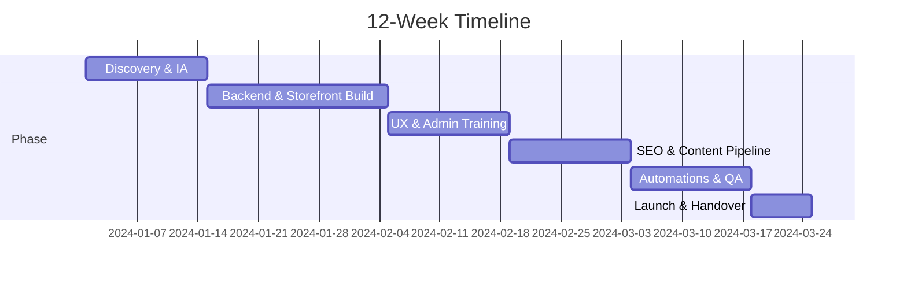
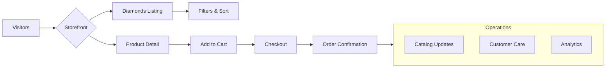

# Proposal

**Total investment (one‑off build)**: 250,000 HKD

The kickoff budget covers design, development and launch. After go‑live, a recurring maintenance retainer ensures the site and supporting services stay healthy.

This proposal outlines the plan to launch a premium lab‑grown diamond storefront and supporting operations. It focuses on outcomes, scope and timelines without technical implementation details. Instead of generating numerous variants for each stone, the solution will leverage **Medusa.js bundled products** with a dedicated **Product Settings** menu to configure rings, necklaces and other styles.

## Deliverables (high‑level)

- [Ecommerce website](./ecommerce)
- [Backend architecture](./backend) (MedusaJS + inventory + imports)
- [Catalog and bundling strategy](./catalog) (white + fancy product types, thousands of SKUs)
- [Operations & management](./operations) (imports, ops, training docs)
- [SEO and content](./seo) (site structure, blog, AI‑assisted long‑form)
- [Branding](./branding) (basic consultancy to start)
- [Social media](./social) (content creation + management)
- [AI automations](./automations) (support bot, order updates)
- [Email marketing](./email) (flows + campaigns)

## Timeline (12 weeks)

## Budget Breakdown (HKD)

- Engineering (backend + frontend): 140,000
- Catalog ops + import tooling: 30,000
- SEO + content system: 20,000
- Branding kickoff (minimal): 10,000
- Social (setup + first month content): 15,000
- Automations (bots + order updates): 15,000
- Email (flows + templates): 10,000
- Contingency: 10,000

> Total one‑off kickoff budget: 250,000 HKD

## Ongoing Monthly Retainer (HKD)

- Agency maintenance (catalog updates, uptime, accessibility): 8,000
- Hosting & infrastructure (Railway, object storage, search): ~1,000
- Social media management & content (incl. one day photo/video): 10,000
- Optional: Performance marketing management (paid social/search): on request

## Vision Diagram

Use the sidebar to see scope per area.

