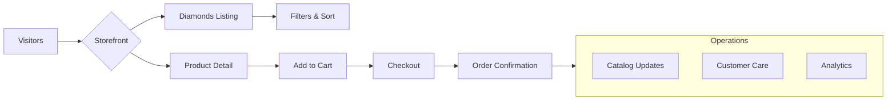

# Proposal

**Total investment (one‑off build)**: 200,000 HKD

This proposal outlines the plan to launch a premium lab‑grown diamond storefront and supporting operations. It focuses on outcomes, scope and timelines without technical implementation details.

## Deliverables (high‑level)

- Ecommerce website (requirements to be finalized)
- Backend architecture (MedusaJS + inventory + imports)
- Catalog and SKU strategy (white + fancy product types, thousands of SKUs)
- Management service (imports, ops, training docs)
- SEO and content (site structure, blog, AI‑assisted long‑form)
- Branding (basic + advanced consultancy)
- Social media (content creation + management)
- AI automations (support bot, order updates)
- Email marketing (flows + campaigns)

## Timeline (12 weeks)

- Weeks 1–2: Discovery, IA, branding baseline, infrastructure
- Weeks 3–5: Backend build (types, seeding, inventory, imports), storefront base
- Weeks 6–7: Filters/table UX, performance, admin training
- Weeks 8–9: SEO structure, content pipeline, blog
- Weeks 10–11: Automations, email flows, QA, UAT
- Week 12: Launch, handover, post‑launch support

## Budget Breakdown (HKD)

- Engineering (backend + frontend): 110,000
- Catalog ops + import tooling: 25,000
- SEO + content system: 18,000
- Branding (basic + advisory): 12,000
- Social (setup + first month content): 10,000
- Automations (bots + order updates): 12,000
- Email (flows + templates): 8,000
- Contingency (3%): 5,000

> Total one‑off: 200,000 HKD

## Ongoing Monthly Retainer (HKD)

- Hosting & infrastructure (Railway, object storage, search, monitoring): 6,000–12,000
- Social Media Management (planning, posting, reporting): 8,000
- Social Content Production (design, copy, short‑form video): 8,000
- Optional: Performance marketing management (ex. paid social/search): on request

## Vision Diagram

Use the sidebar to see scope per area.

